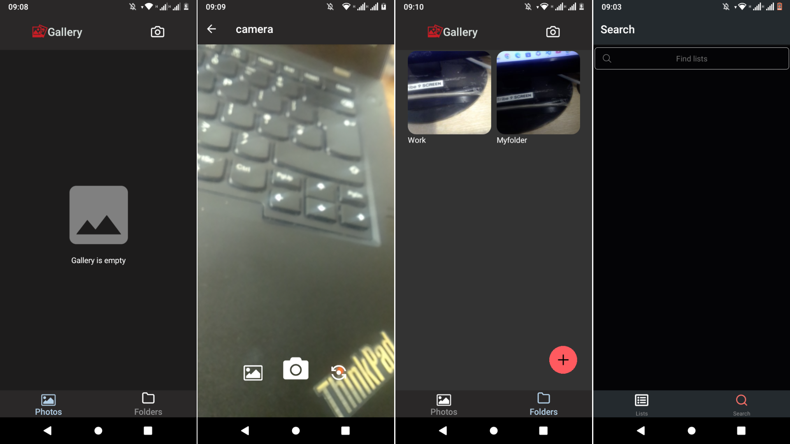

# Image Gallery App

React Native Image Gallery App, with camera, using SQLite as a database to store image metadata.

## Prerequisites

- React Native
- Expo
- SQLite

## Installation

1. Clone the repository

```bash
git@github.com:Lspacedev/image-gallery-app.git
```

2. Navigate to the project folder

```bash
cd image-gallery-app
```

3.  Install all dependencies

```bash
npm install
```

4. Create an env file and add the following:

```bash
GOOGLE_CLOUD_API_KEY="Google cloud api key"
```

5. Run the project

```bash
npx expo start
```

In the output, you'll find options to open the app in a

- [development build](https://docs.expo.dev/develop/development-builds/introduction/)
- [Android emulator](https://docs.expo.dev/workflow/android-studio-emulator/)
- [iOS simulator](https://docs.expo.dev/workflow/ios-simulator/)
- [Expo Go](https://expo.dev/go), a limited sandbox for trying out app development with Expo

## Screenshot



## Features

- Take an image.
- View taken images.
- Update image name.
- Delete image.
- View image location on map.

- View image metadata.
- Create and view images in a folder.
- Move images from gallery to new folder.

## Usage

1. Open the app.
2. Take an image.
3. Find and manage all your images.

## Tech Stack / Tools

- React Native
- Expo MediaLibrary
- AsyncStorage
- React Native Filesystem
- SQlite

## Credits

```python
<a href="https://www.freepik.com/icon/unboxing_11746107">Icon by Iconjam</a>
<a href="https://www.freepik.com/icon/box_1007913">Icon by Freepik</a>
```

## APK:

```python
https://drive.google.com/file/d/1-idcwHJPJB46dPYtW8nbDVM-yXiJJM51/view?usp=sharing
```
